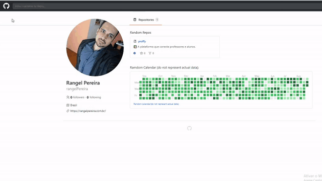
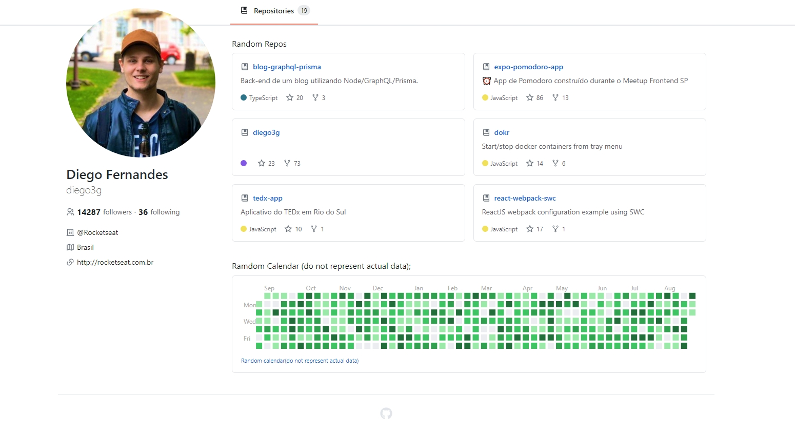
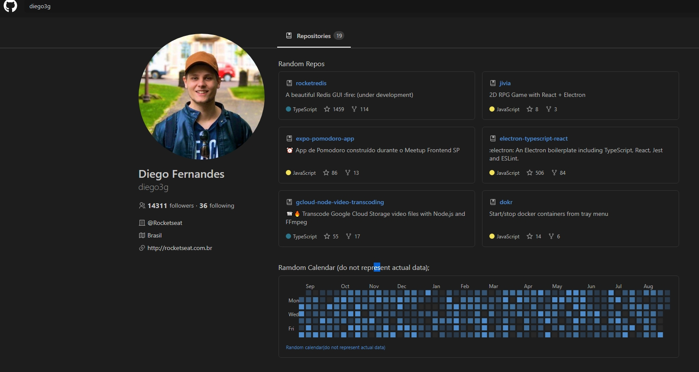

<h1 align="center">
UI Clone - GitHUb
</h1>

<p align="center">Clone do GitHUb com versão dark mode, totalmente responsivo, utilizando a API do proprio GitHub, utilizando assim repositorios reais.
Para a criação do Calendario foi usado a biblioteca react-calendar-heatmap juntamente com o date-fns para criar as contribuições aleatoriamente.</p><br>

<p align="center">
  
  <br/>
  <br/>
</p>

<hr>


## Resultado da aplicação






</div>


## Tecnologias Utilizadas

- [X] ReactJS
- [X] Typescript
- [X] Styled Components
- [X] React-Calendar-Heatmap
- [X] Date-Fns


## :arrow_forward: Como executar

_com **npm**_

```bash
# Instalar dependências
$ npm install
# Iniciar servidor
$ npm start
```

_com **yarn**_

```bash
# Instalar dependências
$ yarn
# Iniciar servidor de desenvolvimento
$ yarn start
```
